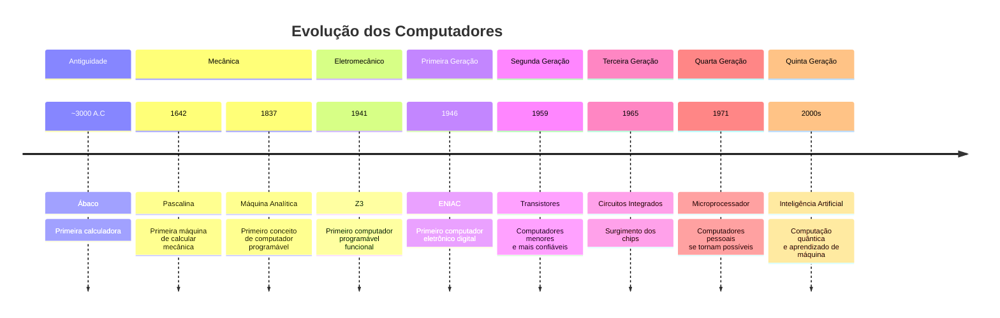

# 🖥️ A História dos Computadores: Da Pedra ao Smartphone

## 🌍 Introdução: Por que conhecer a história?

> "Para entender para onde vamos, precisamos saber de onde viemos."


Você já parou para pensar que o smartphone no seu bolso é **milhões de vezes** mais poderoso que os computadores que levaram o homem à Lua? 

Esta jornada de mais de 5.000 anos nos mostrará como a necessidade humana de **contar, calcular e processar informações** transformou pedras, engrenagens e circuitos nas máquinas incríveis que usamos hoje.

---

## 📜 Linha do Tempo Visual



---

## 🏺 Parte 1: A Era Pré-Computacional (3000 A.C. - 1600 D.C.)

### 1.1 O Ábaco (~3000 A.C.) 🧮


**O que era:**  
O primeiro dispositivo de cálculo da humanidade, inventado na Mesopotâmia.

**Como funcionava:**  
- Bastões com bolinhas que deslizavam
- Cada coluna representava uma casa decimal (unidade, dezena, centena...)
- Extremamente eficiente para operações básicas

**Analogia moderna:**  
> Imagine o contador de likes do Instagram sendo controlado manualmente, bolinha por bolinha!

**Curiosidade:**  
Alguns comerciantes ainda usam ábaco hoje porque, nas mãos de um expert, pode ser **mais rápido que uma calculadora eletrônica** para cálculos simples!

### 1.2 Ossos de Napier (1617) 🦴


**Inventor:** John Napier (escocês)

**O que era:**  
Uma série de bastões numerados que facilitavam multiplicações e divisões complexas.

**Como funcionava:**  
Cada bastão tinha uma tabuada diferente. Alinhando-os corretamente, você podia multiplicar grandes números sem saber a tabuada completa.

**Exemplo prático:**  
Para multiplicar 7 × 8:
- Pegava o bastão do 7
- Lia a linha do 8
- Resultado: 56

**Importância histórica:**  
Primeira tentativa de "mecanizar" a matemática.

---

## ⚙️ Parte 2: A Era Mecânica (1600 - 1900)

### 2.1 A Pascalina (1642) 🎰


**Inventor:** Blaise Pascal (francês, 19 anos!)

**Motivação:**  
Pascal queria ajudar seu pai, que era coletor de impostos e passava horas fazendo cálculos manuais.

**Como funcionava:**  
- Caixa com engrenagens e rodas dentadas
- Cada volta completa de uma roda = +1 na próxima roda (como um hodômetro de carro)
- Podia somar e subtrair automaticamente

**Inovação revolucionária:**  
> Pela primeira vez na história, uma máquina podia **realizar uma operação matemática sem intervenção humana durante o processo**.

**Problema:**  
Era cara, difícil de produzir e só a nobreza podia comprar.

### 2.2 O Tear Programável (1801) 🧵


**Inventor:** Joseph Marie Jacquard (franês)

**O que era:**  
Um tear que usava **cartões perfurados** para controlar padrões complexos de tecido.

**Como funcionava:**  
- Cada furo no cartão = "ligar" um fio específico
- Sequência de cartões = padrão complexo
- Podia "programar" desenhos diferentes trocando os cartões

**Importância CRÍTICA:**  
> Esta foi a **primeira vez que "programação" foi separada da "execução"**. 
> O mesmo tear podia fazer padrões diferentes só trocando os cartões!

**Legado:**  
Os cartões perfurados seriam usados em computadores por mais de **150 anos**!

### 2.3 A Máquina Analítica (1837) 🤖


**Inventora:** Ada Lovelace e Charles Babbage (ingleses)

**O sonho de Babbage:**  
Uma máquina que pudesse calcular **qualquer coisa** - não apenas somas.

**Componentes revolucionários:**
1. **Moinho** → CPU moderna (processamento)
2. **Armazém** → Memória RAM (dados temporários)
3. **Cartões perfurados** → Programas (software)
4. **Impressora** → Saída de dados

**Ada Lovelace - A Primeira Programadora:**  


Ela percebeu que a máquina podia fazer mais que cálculos: podia processar **qualquer informação simbólica**, incluindo música e arte.

> Ada escreveu o **primeiro algoritmo** destinado a ser processado por uma máquina - por isso é considerada a primeira programadora da história.

**Tragédia:**  
A máquina NUNCA foi construída por falta de tecnologia e financiamento. Ficou só no papel... mas o conceito estava completo!

---

## ⚡ Parte 3: A Era Eletromecânica (1900 - 1940)

### 3.1 O Mark I (1944) ⚙️➕⚡


**Criador:** Howard Aiken (EUA) com apoio da IBM

**O que era:**  
Um monstro de 15 metros de comprimento, 2,5 metros de altura, pesando 5 toneladas!

**Como funcionava:**
- Parte mecânica (relés, engrenagens)
- Parte elétrica (motores, fiação)
- Programação por **fita de papel perfurado**
- Podia fazer 3 adições por segundo (lento, mas automático)

**Uso:**  
Cálculos balísticos para a marinha americana na Segunda Guerra Mundial.

**Limitação:**  
Ainda era **mecânico** - partes se desgastavam, fazia barulho enorme e era propenso a falhas.

### 3.2 O Z3 (1941) 🇩🇪


**Criador:** Konrad Zuse (alemão)

**Importância histórica:**  
> Considerado por muitos como o **PRIMEIRO COMPUTADOR PROGRAMÁVEL FUNCIONAL** da história!

**Características:**
- Totalmente automático
- Usava sistema binário (0s e 1s)
- Programável
- Eletromecânico (ainda usava relés)

**Tragédia da guerra:**  
Foi destruído em um bombardeio aliado em 1944. Zuse sobreviveu e reconstruiu o Z3 nos anos 60.

---

## 💥 Parte 4: A Primeira Geração - Válvulas (1940 - 1956)

### 4.1 O Colossus (1943) 🇬🇧🕵️


**Segredo máximo:**  
Foi mantido em segredo por **30 ANOS** após a guerra!

**Propósito:**  
Quebrar códigos nazistas (especificamente a máquina Lorenz).

**Como funcionava:**
- Usava 1.500 válvulas termiônicas
- Programável através de painéis de conexão
- Processamento paralelo (várias operações ao mesmo tempo)

**Impacto histórico:**  
> Os historiadores estimam que o Colossus **encurtou a Segunda Guerra Mundial em 2 anos**, salvando milhões de vidas.

### 4.2 O ENIAC (1946) 🇺🇸💥


**Dimensões épicas:**
- 30 toneladas de peso
- 167 m² de área ocupada
- 17.468 válvulas
- Consumo: 150 kW (uma vila inteira!)

**Propósito original:**  
Cálculos de trajetória de mísseis balísticos.

**Como programavam:**
1. Rearranjavam cabos fisicamente
2. Configuravam 6.000 chaves manualmente
3. Demorava **DIAS** para reprogramar

**Mulheres do ENIAC:**  


Seis mulheres brilhantes (Kay McNulty, Betty Jennings, Betty Snyder, Marlyn Wescoff, Fran Bilas e Ruth Lichterman) foram as **primeiras programadoras** do ENIAC, mas seu trabalho foi pouco reconhecido na época.

---

## 🔌 Parte 5: A Segunda Geração - Transistores (1956 - 1963)

### 5.1 A Revolução do Transistor (1947) ⚡


**Inventores:** John Bardeen, Walter Brattain e William Shockley (Bell Labs)

**O que é um transistor?**  
Um interruptor eletrônico microscópico que pode estar LIGADO (1) ou DESLIGADO (0).

**Vantagens sobre válvulas:**
- 100x menor
- Mais confiável (não queimava)
- Consumia menos energia


**Analogia:**  
> Se uma válvula era uma lâmpada incandescente (grande, quente, frágil),  
> o transistor era um LED (pequeno, frio, durável).

**Prêmio Nobel:** Os inventores ganharam o Nobel de Física em 1956.

### 5.2 IBM 1401 (1959) 💼


**Impacto comercial:**  
Primeiro computador produzido em massa (vendeu 12.000 unidades!).

**Características:**
- Usava transistores (ainda em módulos separados)
- Armazenamento em fita magnética


**Uso típico:**  
Folhas de pagamento, contabilidade, processamento de dados empresariais.

---

## 🧩 Parte 6: A Terceira Geração - Circuitos Integrados (1964 - 1971)

### 6.1 O Chip (1958) 🔬


**Inventor:** Jack Kilby (Texas Instruments) - Nobel de Física 2000

**Conceito revolucionário:**  
> "Por que não fazer todo o circuito em um único pedaço de silício?"

**Primeiro chip:**  
1 transistor, 3 resistores e 1 capacitor em um chip de 11 mm.

**Evolução rápida:**
- 1965: 50 transistores por chip
- 1971: 2.300 transistores (Intel 4004)
- 2024: **50 BILHÕES** de transistores!

### 6.2 IBM System/360 (1964) 🏢


**Revolução empresarial:**  
Primeira família de computadores compatíveis.

**Inovação:**  
Um programa escrito para um modelo pequeno rodava num modelo grande sem modificações.

**Impacto:**  
- Dominou o mercado empresarial por 20 anos
- Introduziu conceitos usados até hoje


---

## 🏠 Parte 7: A Quarta Geração - Computadores Pessoais (1971 - 2010)

### 7.1 O Microprocessador (1971) 🎯


**Criador:** Intel (Marcian Hoff, Federico Faggin, Stan Mazor)

**Intel 4004:**
- 2.300 transistores
- 740 kHz de clock
- 4 bits (processava 4 bits por vez)


**Aplicação inicial:**  
Calculadora Busicom 141-PF (ninguém imaginava PCs na época!)

### 7.2 Altair 8800 (1975) 💡


**Preço revolucionário:**  
US$ 439 (kit) vs. milhares de dólares dos mainframes.

**Como funcionava:**
- Sem teclado, sem monitor
- Programava com chaves na frente
- Resultados em luzes LED
- Interface: papel perfurado ou fita cassete

**Curiosidade:**  
Bill Gates e Paul Allen criaram o Altair BASIC, fundando a Microsoft.

### 7.3 Apple II (1977) 🍎


**Inovações:**
- Primeiro computador com gráficos coloridos
- Teclado integrado
- Design "amigável" para consumidores
- Sucesso em escolas e casas


### 7.4 IBM PC (1981) 💼


**Decisão crucial:**  
IBM usou componentes de terceiros e publicou as especificações.

**Resultado:**  
Surgimento dos "clones" - qualquer um podia fazer um PC compatível.

**Componentes principais:**
- Processador: Intel 8088 (4.77 MHz)
- RAM: 16KB a 256KB
- Sistema operacional: PC-DOS (Microsoft)


**Impacto:**  
Estabeleceu o padrão que dominaria por décadas.

### 7.5 Macintosh (1984) 🖱️


**Revolução da interface:**
- Primeiro computador comercial com mouse
- Interface gráfica (janelas, ícones, menus)
- "O computador para o resto de nós"

**Commercial icônico:**  
Durante o Super Bowl, direção de Ridley Scott, custo de US$ 900.000.

**Especificações:**
- CPU: Motorola 68000 (8 MHz)
- RAM: 128KB (sim, kilobytes!)
- Tela: 9" preto e branco


---


### 8 Smartphones (2007) 📱


**Antes do iPhone:**
- Telefones com teclado físico
- Internet limitada
- Poucos aplicativos

**Revolução do iPhone (2007):**
- Tela touch capacitiva (multi-toque)
- Navegador web completo
- App Store (2008)
- Design minimalista

**Impacto:**  
Transformou telefones em computadores de bolso.

### 8.2 Tablets (2010) 📟


**Tentativas anteriores:**  
Tablets existiam desde os anos 90, mas eram caros e pouco práticos.

**iPad (2010):**
- Interface otimizada para toque
- Bateria de 10 horas
- Milhares de apps desde o início

**Impacto:**  
Criou uma nova categoria entre smartphones e laptops.

---


## 📊 Comparação Impressão do Poder de Processamento

| Ano | Computador | Transistores | Velocidade | Custo (ajustado) | Poder vs. ENIAC |
|-----|------------|--------------|------------|------------------|-----------------|
| 1946 | ENIAC | 17.468 válvulas | 5.000 ops/s | US$ 6 milhões | 1x |
| 1971 | Intel 4004 | 2.300 | 92.000 ops/s | US$ 400 | 18x |
| 1993 | Pentium | 3.1 milhões | 100 MIPS | US$ 1.000 | 20.000x |
| 2000 | Pentium 4 | 42 milhões | 1.5 GHz | US$ 800 | 300.000x |
| 2024 | iPhone 15 | 19 bilhões | 3.5 GHz | US$ 1.000 | **100 MILHÕES x** |

> **Fato impressionante:** Se o ENIAC fosse um carro andando a 5 km/h, um iPhone 15 seria uma nave espacial viajando à velocidade da luz!

---

## 🎬 Vídeo Recomendado

**Canal:** **infinitamente**  
**Título:** "Como Reinventar o Computador do Zero"

#### Confie em mim, esse vídeo é muito bom e principalmente didático.

🔗 [Veja Aqui!](https://youtu.be/BbnDmeNojFA?si=475G5X82gAiRmyAo)


**Por que recomendar este vídeo:**
- Produção profissional brasileira
- Didático e bem humorado
- Cobre desde o ábaco até smartphones
- Apresentado pelo canal (infinitamente)

---

## 📚 Linhas do Tempo Adicionais

### Evolução do Armazenamento:
```
Punções em cartões (1801) → Fita magnética (1950) → Disquete (1971) → HD (1956) → CD (1982) → DVD (1995) → Pendrive (2000) → SSD (2008) → Nuvem (2006)
```

### Evolução das Interfaces:
```
Cartões perfurados → Teletype → Linha de comando → Interface gráfica → Mouse → Touch → Voz → Gestos → Neural (futuro)
```

### Evolução do Tamanho:
```
Salas inteiras (1940s) → Armários (1960s) → Mesa (1970s) → Laptop (1980s) → Bolso (2000s) → Pulso (2010s) → Invisível? (2030s?)
```

---

## 🤔 Reflexões Finais

### Padrões que se repetem:
1. **Grande → Pequeno:** Salas → bolsos
2. **Caro → Barato:** Milhões → centenas
3. **Especialista → Todos:** Cientistas → crianças
4. **Isolado → Conectado:** Máquinas solitárias → internet global

### Lições da História:
- **Inovações disruptivas** muitas vezes vêm de onde menos se espera
- **Padrões abertos** tendem a vencer no longo prazo
- **Acessibilidade** é tão importante quanto capacidade técnica
- **Software** frequentemente determina o sucesso mais que hardware

### O Futuro (especulações):
- **Computação ubíqua:** Computadores em tudo (Internet das Coisas)
- **Interfaces naturais:** Voz, gestos, pensamento (?)
- **Realidade aumentada:** Misturando digital e físico
- **Bio-computação:** Computadores usando DNA ou células
- **Singularidade tecnológica:** IA superando inteligência humana

---

## 🏆 Grandes Nomes para Lembrar

| Nome | Contribuição | Ano |
|------|--------------|-----|
| **Charles Babbage** | Máquina Analítica (conceito) | 1837 |
| **Ada Lovelace** | Primeiro algoritmo | 1843 |
| **Alan Turing** | Computabilidade, IA | 1936 |
| **John von Neumann** | Arquitetura moderna | 1945 |
| **Grace Hopper** | Primeiro compilador | 1952 |
| **Jack Kilby** | Circuito integrado | 1958 |
| **Gordon Moore** | Lei de Moore | 1965 |
| **Tim Berners-Lee** | World Wide Web | 1991 |
| **Steve Jobs** | Computação pessoal acessível | 1976-2011 |

---

## 🎯 Conclusão: Por que isso importa HOJE?

Entender a história dos computadores nos ajuda a:

1. **Valorizar o presente:** Seu smartphone é um milagre tecnológico!
2. **Antecipar o futuro:** Padrões históricos sugerem tendências
3. **Tomar melhores decisões:** Comprar tecnologia, escolher carreira
4. **Resolver problemas:** Muitos "novos" problemas já foram resolvidos no passado
5. **Inspirar-se:** Pessoas comuns criaram revoluções extraordinárias

> **Pense nisso:** Da próxima vez que usar seu smartphone, lembre-se que você carrega no bolso o resultado acumulado de **5.000 anos** de inovação humana, trabalho árduo e genialidade coletiva.


---

*Documento educativo criado para fins de aprendizagem • Compartilhe o conhecimento!*  
*Última atualização: 2026 • Imagens: Wikimedia Commons, istockphoto.com, Pixels*